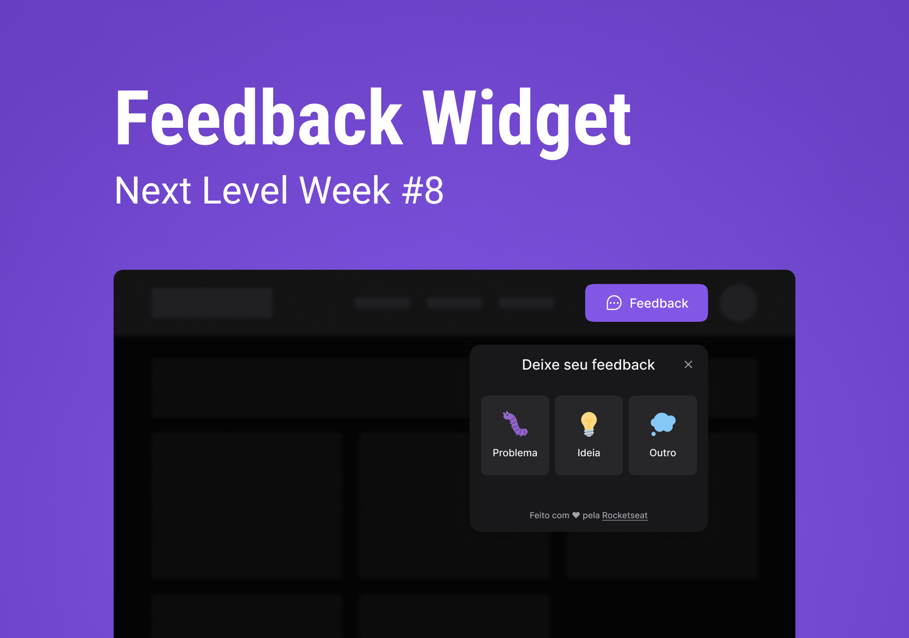
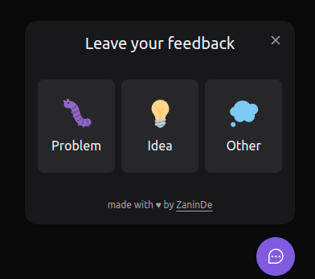

<p align="center" >
    
</p>
<p aling="center">

[](https://github.com/ZaninDe)
[](#)
[](https://github.com/ZaninDe/feedget/stargazers)
[](https://github.com/ZaninDe/feedget/network/members)
[](https://github.com/ZaninDe/feedget/graphs/contributors)

# NLW Return - Impulse 🚀
Project developed with [Rocketseat](https://www.rocketseat.com.br/) in Next Level Week Return, Impulse trail, over the days 01/05/2022 and 08/05/2022.

## 💻 Project
- There is a Widget tools to send feedbacks that can be use in any site.
- When clicked a pop-up open to make a sugestion, report or anything you want.

# :camera: Screenshots
<div align="center">
   
   
   
</div>

## 🧪 Tech
- [React](https://reactjs.org/)
- [NodeJS](https://nodejs.org/en/)
- [TailWind CSS](https://tailwindcss.com/)
- [Headless UI](https://headlessui.dev/)
- [Prisma](https://www.prisma.io/)
- [Jest](https://jestjs.io/)
- [Vite](https://vitejs.dev/)
- [MailTrap](https://mailtrap.io/)
- [Railway](https://railway.app/)
- [Vercel](https://vercel.com/)

## 🛠️ Feactures
- you can attach a screenshot in feedback.
- everything works through the keyboard.
> ### ➕ Added
> - the theme will be able to changed to light/dark.

## 🔮 Layout
Access the layout through the link [Figma](https://www.figma.com/community/file/1102912516166573468).

## 📄How to run
Clone this repository.
```bash
git clone https://github.com/ZaninDe/feedget
```
```bash
$ cd feedget
```

```bash
$ npm install
```
- On the directory `web` add `.env.local` with URL of the your database
```bash
VITE_API_URL=""
```
- On the directory `server` add `.env` with the path of `dev.db`, your development database in `prisma` directory.
```bash
DATABASE_URL="file:./dev.db"
```
## 💭 Bonus
- See the project running with this [URL](https://feedget-zaninde.vercel.app/).
